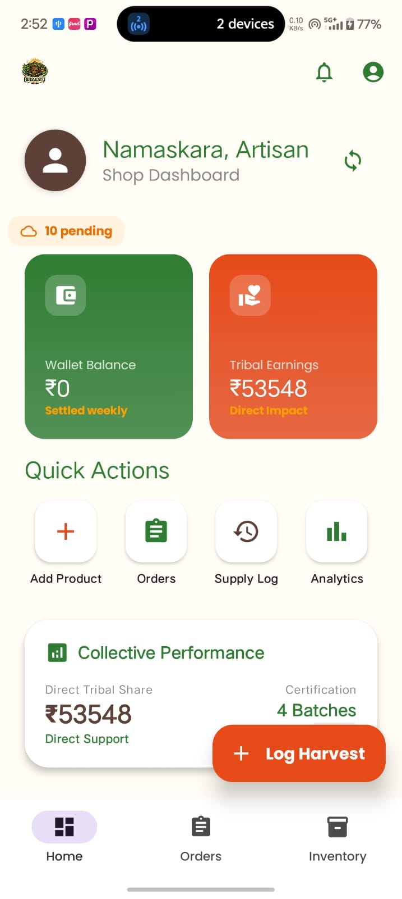
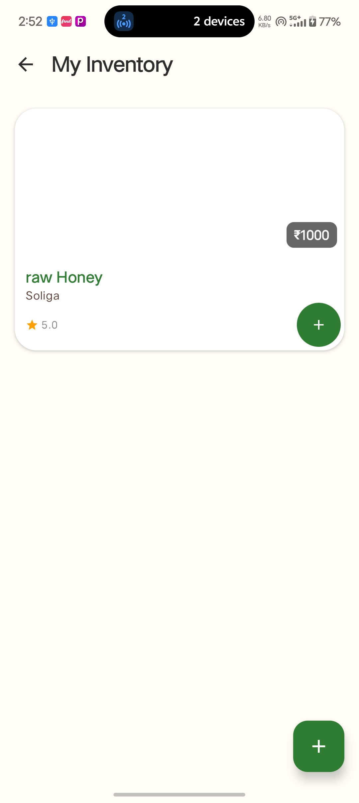
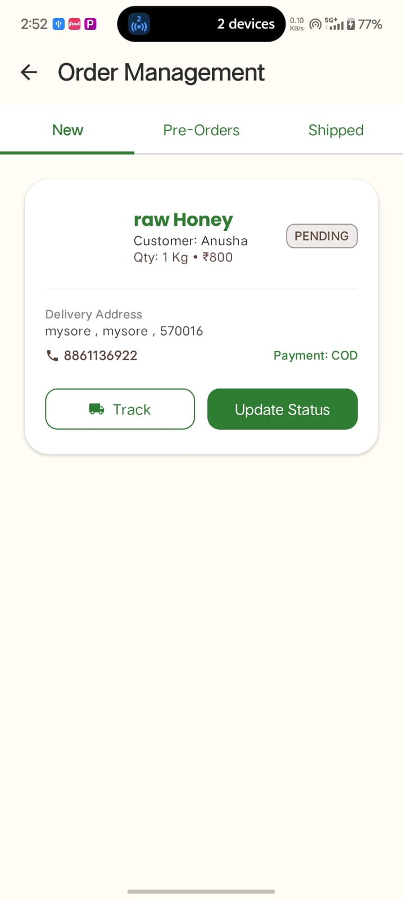
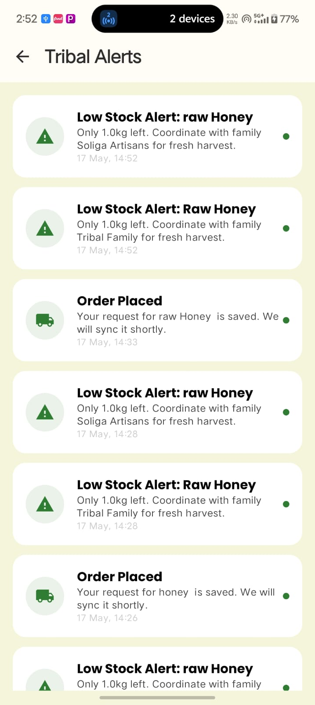
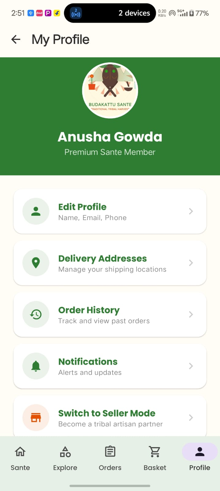
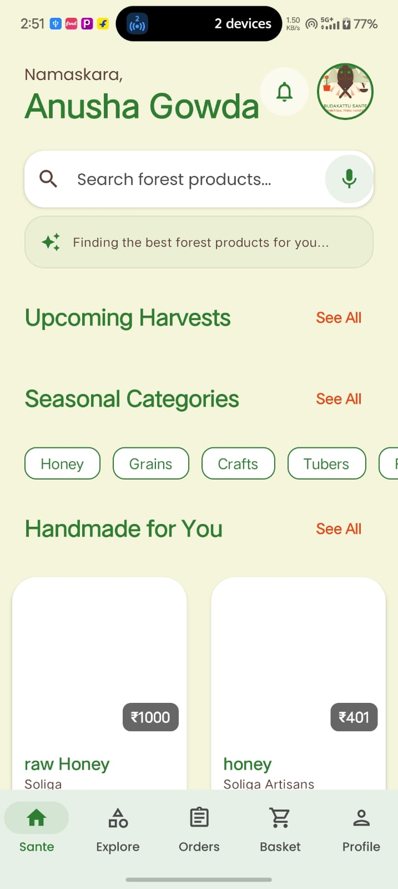
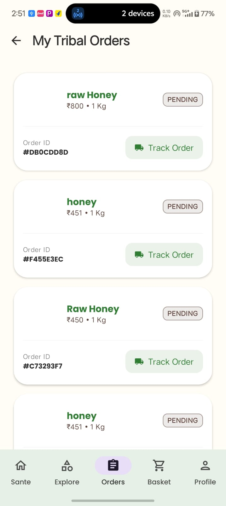
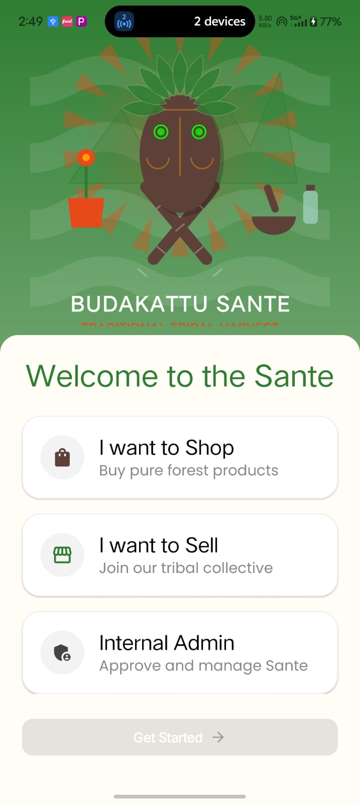
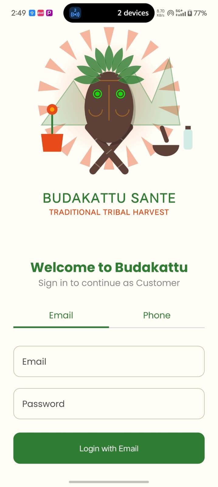

# Budakattu Sante

## Traditional Tribal Harvest Marketplace

Budakattu Sante is an AI-enabled Android marketplace designed to support tribal communities, forest harvest vendors, and rural artisans through a transparent and sustainable digital commerce platform.

The application connects tribal sellers directly with customers, reducing middlemen exploitation and improving fair-trade accessibility.

Built using Kotlin, Jetpack Compose, Firebase, Google Maps APIs, and AI-assisted accessibility features, the platform supports product sales, harvest tracking, preorder systems, multilingual accessibility, and audio-assisted interaction for semi-literate users.

---

# Problem Statement

Many tribal artisans and forest product collectors face major challenges:

* Limited direct market access
* Middlemen exploitation
* Lack of transparent pricing
* Low digital visibility
* No product traceability
* Language and literacy barriers

Budakattu Sante addresses these issues through a fair-trade digital ecosystem with transparent workflows and accessible user experience.

---

# Main Features

## Customer Features

* Browse tribal and forest products
* Search and filter products
* Wishlist and basket management
* Place product orders
* Pre-order future harvests
* View harvest origin and supply chain
* Order tracking
* Multiple payment methods
* Audio-based product guidance
* Product categories and recommendations

## Vendor Features

* Vendor profile management
* Edit business details
* Upload and manage products
* Publish fresh harvests
* Future harvest preorder system
* Inventory management
* Supply log tracking
* Order management
* Wallet and payment tracking
* Tribal artisan management
* Harvest analytics dashboard

## Admin Features

* Vendor approval system
* Product activity monitoring
* Fair-trade compliance management
* Analytics and reporting
* Marketplace monitoring

## AI and Accessibility Features

* Voice-to-text product search
* Audio-based product descriptions
* Semi-literate user accessibility support
* AI-based product recommendations
* Smart notifications and alerts

---

# Tech Stack

## Frontend

* Kotlin
* Jetpack Compose
* Material Design 3

## Backend

* Firebase Authentication
* Firebase Firestore
* Firebase Storage

## Additional Technologies

* Google Maps API
* Google Location Services
* Room Database
* WorkManager
* Voice Recognition APIs
* Git and GitHub

---

# Project Modules

* Authentication Module
* Customer Marketplace
* Vendor Dashboard
* Inventory System
* Harvest Logging System
* Supply Chain Tracking
* Wallet and Payments
* Order Management
* Notification System
* AI Accessibility System

---

# Folder Structure

```text
app/
 ├── src/main/java/com/mindmatrix/budakattusante
 │    ├── ui
 │    ├── screens
 │    ├── viewmodel
 │    ├── worker
 │    ├── util
 │    ├── data
 │    └── theme
 ├── res
 └── AndroidManifest.xml
```

---

# Application Screens

* Splash Screen
* Role Selection Screen
* Customer Home Screen
* Vendor Dashboard
* Vendor Profile
* Inventory Screen
* Supply Log and Tracking
* Harvest Logging
* Order Management
* Notifications
* Wishlist
* Product Details
* Payment Screen

---

# Working Functionalities

* GitHub repository integration
* Firebase authentication
* Product inventory system
* Harvest preorder system
* Vendor profile editing
* Order tabs and tracking
* Google Maps integration
* Voice input support
* Dynamic navigation
* Real-time Firestore updates

---

# Payment Features

## Supported Payment Methods

* UPI
* UPI ID
* Cash on Delivery
* ATM and Card Payment

## Checkout Features

* Address form
* Payment method selection
* Order confirmation
* Vendor order notification

---

# Supply Log and Product Traceability

The platform tracks:

* Forest region
* Village or Podu source
* Harvest coordinates
* Harvest batches
* Tribal artisan contribution
* Product origin mapping
* Supply chain visibility

This improves transparency, trust, and fair-trade accountability.

---

# App Screenshots

## Vendor Dashboard


## Business Analytics


## Vendor Profile


## Inventory Management


## Order Management


## Notifications


## Customer Profile


## Customer Home Screen


## Tribal Basket


## Login Screen


## Login Email and Phone



# Installation Guide

## Clone Repository

```bash
git clone https://github.com/anusha0934/budakattu-sante.git
```

## Open Project

Open the project using Android Studio.

## Firebase Setup

Add the Firebase configuration file:

```text
app/google-services.json
```

Enable the following services:

* Firebase Authentication
* Firestore Database
* Firebase Storage

## Build and Run

1. Sync Gradle
2. Sync Project with Gradle Files
3. Run the application
4. Use Android Emulator or physical device

---

# Future Improvements

* Multilingual tribal language support
* AI chatbot assistant
* Offline marketplace mode
* Blockchain-based product verification
* Digital tribal certification
* Live logistics tracking
* AI demand forecasting

---

# GitHub Repository

Repository Link:

[Budakattu Sante GitHub Repository](https://github.com/anusha0934/budakattu-sante?utm_source=chatgpt.com)

---

# Project Status

Current Status:

* Active development
* Firebase integrated
* UI screens implemented
* Core modules connected
* Marketplace workflow in progress

---

# Developer

## Anusha K A

BE in Data Science
Android and AI Developer
